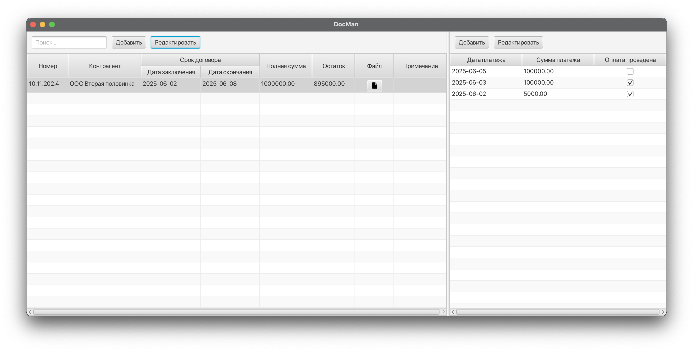
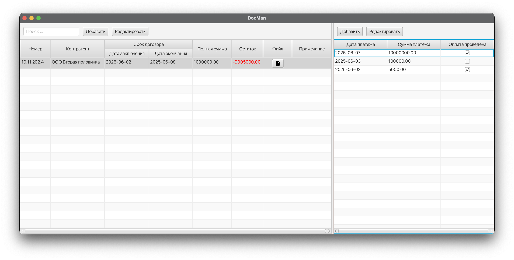
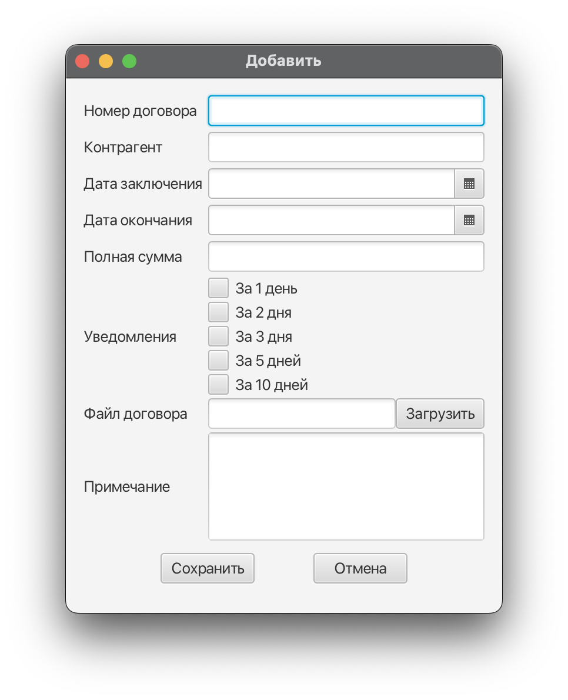
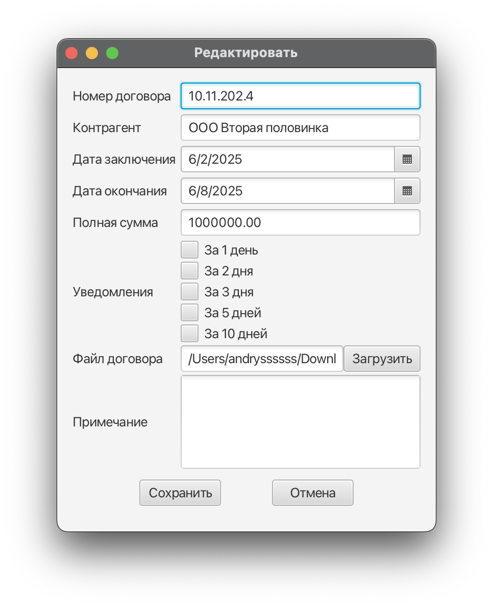
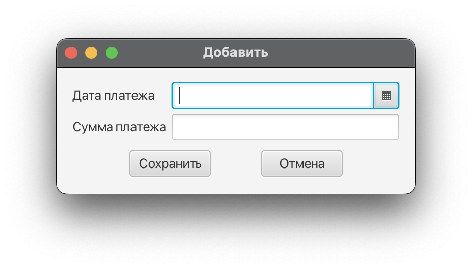
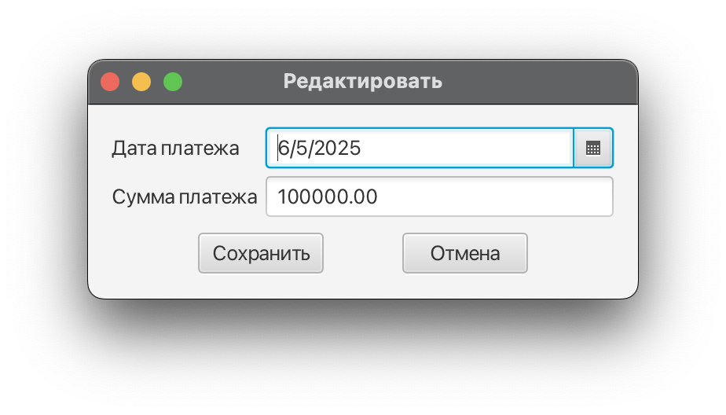
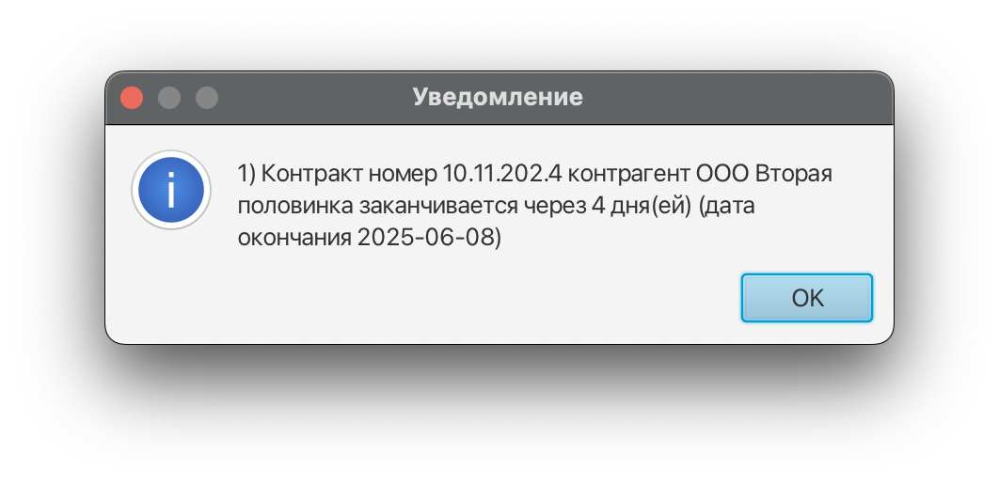
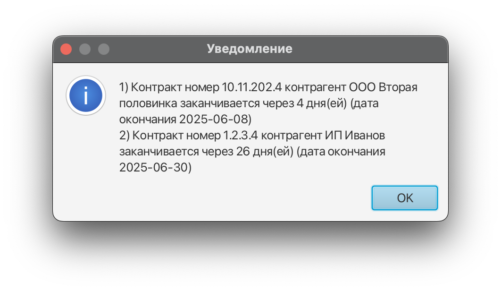

# DocMan

## Summary

Desktop GUI application for contracts and payments management.

Functionality:
- Add new, list, edit contracts
- Attach file to the contract and open it from the app
- Subscribe and receive notifications when the contract is about to expire
- Add new, list, edit contract payments
- Mark payments as completed/uncompleted and keep track of the contract balance

## Usage

1. Build jar file from project (`mvnw clean package` builds jar and places it in the *target* directory)
2. [Optional] Create exe file from built jar (e.g. with [Launch4j](https://launch4j.sourceforge.net/) or with [GraalVM JDK](https://www.graalvm.org/latest/reference-manual/native-image/))

**Notice**: JRE 11 and higher (with JavaFX support) required to run the app (e.g. [BellSoft Liberica full JRE](https://github.com/bell-sw/Liberica))

## Screenshots

1. Main app screen
  
  

2. Add, edit contract screen
  
  

3. Add, edit payment screen
  
  

4. Notification warning screen
  
  

## Tech stack

* Java 11+
* JavaFX
* H2 database
* Hibernate
* Spring Framework
